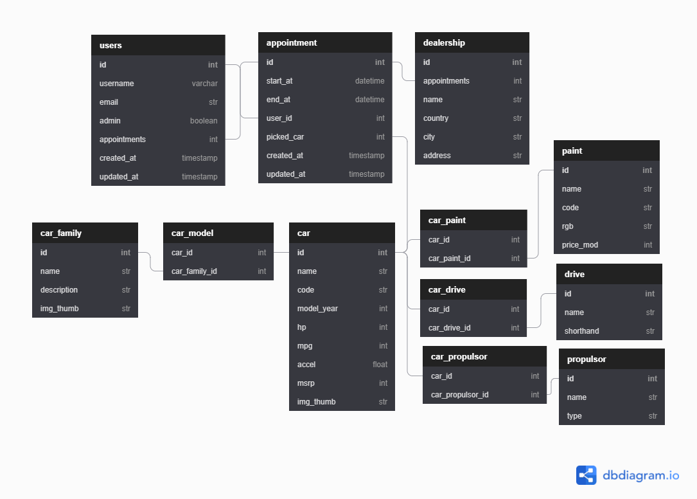

# **BMW Test Drive - API** 
# Final Capstone Project.
 
This is a solo project at the end of the Microverse Main Technical Curriculum. It's a real-world-like project, built with business specifications to improve and test the achievement of technical and soft skills gained during the program. The technical requirements of this API project are:

1. The database should have at least 2 tables
2. Use Postgres as your database
3. Back-end you will use Ruby on Rails
4. Create a REST API to manage database resources
 
## **Built With**
 
- Ruby on Rails
- bcrypt
- faker
- JWT
- Heroku
 
## **How To Use**
 
### **Structure**

This application is the back-end API  used with the project [BMW Test Drive](https://github.com/Bismarck-GM/bmw-test-drive)

The tables created are related according to the following diagram:

 

### **Endpoints of API**

| Method  | Endpoint                      | Functionality                      |
| ---     | ---                           |  ---:                              | 
| POST    |  /api/v1/login                | Log In Users                       | 
| POST    |  /api/v1/register             | Create Users                       | 
| POST    |  /api/v1/appointments         | Create Appointment                 | 
| GET     |  /api/v1/cars                 | Get all Cars                       |
| GET     |  /api/v1/dealerships          | Get all Dealerships                | 
| GET     |  /api/v1/appointments         | Get all appointments               |
| DELETE  |  /api/v1/appointments         | Delete an appointment              |
| GET     |  /api/v1/models               | Get all Models/Car Family          |
| GET     |  /api/v1/users                | Get all users (Admin only)         |
| POST    |  /api/v1/dealerships          | Create Dealership (Admin only)     | 
| GET     |  /api/v1/admin/appointments   | Get all appointments (Admin only)  |

## **API Deployed At:**
 
### [Heroku](https://bmw-test-drive.herokuapp.com/api/v1/cars)

## **Live Project At:**

### [GitHub Pages | BMW - Test Drive](https://bismarck-gm.github.io/bmw-test-drive/)
 
## **Getting Started**
 
Clone the repository by clicking on "Clone or Download" and copy the given link. In your terminal, go to the folder where you want the project to be and use the following command:
 
`git clone https://github.com/Bismarck-GM/BMW-test-drive-backend.git`
 
After that, open the folder with the code editor of your choice and follow the steps below.
 
## **Setting up the necessary packages:**
 
**Make sure you have [Yarn](https://yarnpkg.com/) installed in your machine.**
 
**Open the terminal and go to the folder of the game and run the following commands:**  
`yarn install`

`bundle install`
 
**Those commands will ensure you installed the proper packages required and install all the gems needed for the project.**
 
## **Configure the Database**
**You need to configure the database with the following commands:**  
`rails db:create db:migrate db:seed`  

**This command will create the database, migrate the tables as necessary, and populate it needed some data.**

**If you have any problem configuring postgresql, check this [docs](https://www.digitalocean.com/community/tutorials/how-to-use-postgresql-with-your-ruby-on-rails-application-on-ubuntu-18-04) for more info**

## **Starting the Server**
**To start the server run:**  
`rails s -p 3001`

**This command will make sure you run the project at the 3001 port, so you don't have any conflict with the front-end port, which is usually 3000.**

## **Testing**
**To check the test run the following command:**  
`bundle exec rspec`

 
## **Author**
 
👤 **Gerónimo Morisot**

- Github: [@Bismarck-GM](https://github.com/Bismarck-GM)
- Twitter: [@Rewritablee](https://twitter.com/Rewritablee)
- LinkedIn: [Geronimo Morisot](https://linkedin.com/in/geronimomorisot)
 
## 🤝 **Contributing**
 
Contributions, issues, and feature requests are welcome!
 
Feel free to check the [issues page](https://github.com/Bismarck-GM/BMW-test-drive-backend/issues).
 
## **Show your support**
 
Give a ⭐️ if you like this project!
 
## **Acknowledgments**
 
- Microverse for the opportunity;
- The Minskins for the support.
 
## 📝 **License**
 
This project is [MIT](LICENSE) licensed.
 

